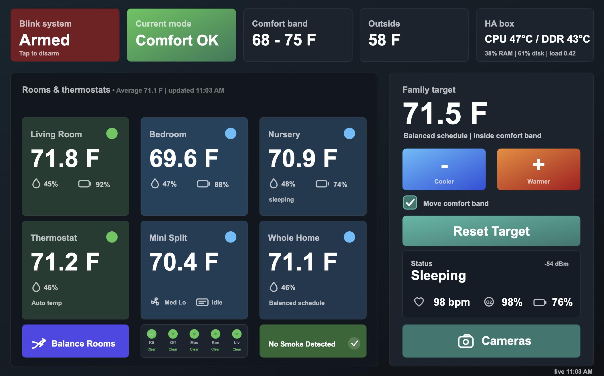

# HA Light Panel

A tiny Home Assistant panel server for low-power browsers, old tablets, kiosk displays, and digital photo frames.

Instead of loading the full Home Assistant frontend, HA Light Panel serves a small SVG/HTML interface and pulls state from the Home Assistant REST API. The browser does very little work, which makes it a good fit for slow Android WebViews and cheap wall panels.



If this saves you a little time, [buy me a coffee](https://paypal.me/ABPaintball/5). Add `Buy me a coffee` in the PayPal note so I know what it was for.

[](https://paypal.me/ABPaintball/5)

## Features

- Lightweight climate dashboard with six room cards
- Desktop visual SVG panel layout builder with native config export
- Compact SVG UI, no frontend framework
- Landscape kiosk layout that reflows for portrait phones
- Home Assistant REST polling
- Config-driven entity mapping
- Temperature, humidity, battery, HVAC mode, comfort band, and status-panel cards
- Optional camera snapshot grid
- Optional settings page for humidity-biased cooling and seasonal mode
- Optional Blink live-view proxy integration hooks, health modal, and SMS re-auth
- Service-backed action buttons for comfort tweaks and room balancing
- HACS integration that proxies the panel through Home Assistant, so it works
  over Nabu Casa and anything else that only tunnels port 8123
- HAOS add-on, Docker, and systemd deployment examples
- No runtime npm dependencies

## Installation

Choose the deployment that owns the panel service: Home Assistant add-on,
Docker Compose, managed systemd, or manual Node.js/custom service. The complete
commands, first-run configuration, update path, and optional HACS proxy steps
are in the [installation guide](docs/installation.md).

## HACS Integration

The panel runs on its own port, which anything that only tunnels Home Assistant
core — Nabu Casa Cloud especially — cannot reach. The bundled `ha_light_panel`
integration reverse-proxies the panel at `/api/ha_light_panel/` so it is
reachable wherever Home Assistant is.

1. In **HACS**, click ⋮ → **Custom repositories**.
2. Add `https://github.com/Teethree89/ha-light-panel` with type **Integration**.
3. Download **HA Light Panel** and restart Home Assistant.
4. **Settings → Devices & Services → Add Integration → HA Light Panel**, then
   point it at the panel (`http://127.0.0.1:8890` for a systemd install on the
   same host).

This proxies a panel you are already running; it does not run one. See
[docs/integration.md](https://github.com/Teethree89/ha-light-panel/blob/main/docs/integration.md).

After restarting Home Assistant, the integration also adds an admin-only
**HA Light Panel** item to the Home Assistant sidebar. It keeps the normal HA
navigation visible while switching between the panel **Overview** and the
visual **Builder**. Its **Device links** page copies the recommended panel and
builder URLs for phones, tablets, desktops, and wall displays. If the panel is
not connected, **Find panel address** tests safe local candidates and only
offers services that identify as HA Light Panel. The original direct URLs
remain available as well.

## Home Assistant OS Add-on

The easiest install path if you're running Home Assistant OS or Supervised:

1. Go to **Settings → Add-ons → Add-on Store**.
2. Click ⋮ → **Repositories** and add:
   ```
   https://github.com/Teethree89/ha-light-panel
   ```
3. Find **HA Light Panel**, click **Install**, then set your `ha_token` and `ha_url` in the add-on options and start it.
4. To show your own sensors, copy [examples/starter.json](https://github.com/Teethree89/ha-light-panel/blob/main/examples/starter.json) to `/config/ha-light-panel.json`, edit the entity IDs, and restart the add-on. Without it the panel renders its built-in reference layout.

The panel will be available at `http://<your-ha-host>:8890/`.

See [addon/DOCS.md](https://github.com/Teethree89/ha-light-panel/blob/main/addon/DOCS.md) for the full option reference.

## Try It Without Home Assistant

To see the panel before wiring anything up:

```sh
npm run demo
```

Then open `http://127.0.0.1:8890/`.

This starts a stub Home Assistant with plausible readings and points the panel
at it — no token, no real HA, nothing touching your own entities. The panel
speaks to Home Assistant over exactly two REST endpoints (`GET /api/states` and
`POST /api/services/...`), so the stub is indistinguishable from the real thing
as far as the panel is concerned. Buttons work; they log the service call
instead of firing it.

## Quick Start (Node.js)

New here? The [getting started guide](https://github.com/Teethree89/ha-light-panel/blob/main/docs/getting-started.md)
walks through the whole thing, including how to find your entity ids and what to
check when a card shows `--`.

1. Copy the starter config:

```sh
cp examples/starter.json config.json
```

`examples/starter.json` is a small, commented config with three room cards.
`examples/frameo-climate.json` is the everything-switched-on reference — useful
to crib from, but a lot to edit as a first step.

2. Create a Home Assistant long-lived access token.

In Home Assistant, open your profile, create a long-lived access token, and put it in `.env` or your service env file.

```sh
cp .env.example .env
```

3. Edit `.env`:

```sh
HA_URL=http://homeassistant.local:8123
HA_TOKEN=your-token-here
CONFIG_PATH=./config.json
```

4. Edit `config.json` and replace the example entity IDs with your entities.

5. Run it:

```sh
npm run validate
npm start
```

Open:

```text
http://localhost:8890/
```

## Visual Panel Layout Builder

> **Work in progress.** The builder safely exports a reviewed `config.json`,
> but it is not yet a complete replacement for every bespoke SVG region or a
> general Lovelace editor. Back up your config and test changes before using
> them on a primary display. See the [builder status and limits](docs/installation.md#visual-builder-status--work-in-progress).

Open the builder from a desktop browser at one of these URLs:

- Direct Node, Docker, or add-on install: `http://<panel-server>:8890/builder`
- Through the optional HA Light Panel HACS integration: `https://<your-ha-url>/api/ha_light_panel/builder`

The builder loads any existing native SVG composition first. Those imported
regions retain their actions and live values; their geometry and labels are
exported under `panel.layout.nativeCards`. New cards are intentionally generic:
add a **Display card** for any entity or attribute, an **Action button** for a
Home Assistant service or script, or fixed **Text**. Action buttons can have
confirmation, success, and failure modals. Drag, resize, duplicate, and style
each card with colours and font sizes. Canvas presets cover common landscape
and portrait displays; portrait mode can stack cards automatically or keep a
separately adjusted layout.

When the panel has a working `HA_URL` and `HA_TOKEN`, Entity ID fields offer
every Home Assistant entity by ID and friendly name. The draft stays in the
browser. **Copy config** and **Download config** export a reviewed
`config.json`; install that file and restart the panel service to apply it.
The builder never writes to Home Assistant or overwrites a running service
configuration from the browser.

### Configurable actions

Select **Balance rooms** in the Layout Builder to configure its Home Assistant
service or script and optional JSON service data. Its action inspector also
offers checkboxes for the HVAC readiness guard, a confirmation modal, and
success/failure modals. The readiness guard is enabled by default and is
enforced by the server as well as the browser. Action and modal settings are
saved under `panel.layout.nativeCards.btnBalance.action`; the prior
`panel.actions.assist` remains the fallback for existing configurations.

Generic Action buttons use the same modal controls, but save under their entry
in `panel.layout.cards`. The panel resolves the card ID and configured service
on the server, so a browser cannot substitute a different service or payload.

## Docker

For the full Docker/Compose install, configuration, restart, and update steps,
see [the installation guide](docs/installation.md#2-docker-compose).

```sh
cp examples/starter.json config.json
cp .env.example .env
docker compose -f docker-compose.example.yml --env-file .env up -d --build
```

## systemd

For standard and custom-service adoption instructions, including the precise
updater service name, see [the installation guide](docs/installation.md#3-managed-systemd).

On a Debian-style host with Node.js 20+ use the managed installer:

```sh
curl -fsSL https://raw.githubusercontent.com/Teethree89/ha-light-panel/main/scripts/bootstrap.sh | sudo bash
```

It keeps a tagged source checkout, deploys the released server code, preserves
`/etc/ha-light-panel.env` and `/opt/ha-light-panel/config.json`, and installs
an on-demand updater. When adopting a legacy config-less panel, it first saves
the exact built-in Frameo layout as `/opt/ha-light-panel/config.json` rather
than replacing it with the generic example. Re-run the same command to upgrade. Set
`INSTALL_AUTOUPDATE=1` before the command to enable the optional daily check.

The HA sidebar **Overview** detects this managed systemd installation, reports
live panel and HA-data status, and offers **Update panel now**. The update
status bar follows the service lifecycle while it restarts; it is deliberately
not presented as a fake download percentage. The Node process cannot run
privileged commands: it writes a local request that a root-owned systemd path
unit consumes.

The same Overview gives the appropriate instructions for a Home Assistant
add-on, Docker/Compose, and manual/custom-service deployment. Only a detected
managed systemd updater gets an in-app update button; add-ons, containers, and
custom hosts remain owned by their respective deployment tools.

From a local checkout, `sudo scripts/install-systemd.sh` performs the same
install. Then edit the environment and config only on first setup:

```sh
sudo nano /etc/ha-light-panel.env
sudo nano /opt/ha-light-panel/config.json
sudo systemctl restart ha-light-panel
```

### Adopt an existing service

If an older installation already has a differently named service, adopt it by
passing its service name, app directory, environment file, and service user to
the same bootstrap script. This preserves the existing environment and
`config.json`, installs the updater units beside that service, and restarts it.

If a prior adoption accidentally created the generic example file, export the
legacy built-in layout safely. The command first saves the current file as a
timestamped `config.json.before-layout-capture.*` backup:

```sh
sudo env APP_DIR=/opt/frameo-svg-dashboard \
  bash /opt/src/ha-light-panel/scripts/capture-default-config.sh
```

For a panel running on the same Home Assistant host, set the service-only API
address to `http://127.0.0.1:8123`; use the browser-facing HA URL separately
when needed. Do not put a token in `config.json`:

```sh
sudo nano /etc/frameo-dashboard.env
# HA_URL=http://127.0.0.1:8123
# HA_BROWSER_URL=https://ha-server.home
# HA_TOKEN=your-long-lived-access-token
sudo systemctl restart frameo-svg-dashboard
```

Then open:

```text
http://your-server:8890/
```

## Configuration

See the [configuration guide](https://github.com/Teethree89/ha-light-panel/blob/main/docs/configuration.md).

The most important sections are:

- `homeAssistant`: HA URL and optional browser URL
- `panel.metrics`: top-card entity IDs
- `panel.rooms`: six room cards
- `panel.mode`: which sensors decide the headline status
- `panel.comfort`: comfort-band targets and schedule state
- `panel.actions`: service calls for buttons
- `panel.statusPanel`: optional side status widget
- `panel.balance`: gating for the Balance Rooms button
- `cameras`: optional camera snapshot/live mappings

Config keys merge over built-in defaults, so a config file only needs the keys
it changes, and environment variables win over both. The panel logs which config
file it loaded at startup. If the file is missing or fails to parse, it says so
and falls back to the defaults rather than failing to start.

## Blink Live View Proxy

HA Light Panel can show Blink snapshots by using normal Home Assistant camera
entities. For direct live view, push-to-talk, local clip browsing, and manual
snapshot refresh buttons, it expects the separate Blink Liveview Proxy package:

[Blink Liveview Proxy](https://github.com/Teethree89/ha-blink-live-view-proxy)

The proxy package contains:

- a Home Assistant custom integration that exposes `camera.blink_live_*`
  entities and local `/api/blink_liveview_proxy/...` routes
- a small Python service that logs in to Blink with BlinkPy and bridges the
  direct Blink live-view stream
- install, configuration, systemd, and known-limitations docs

### Installing the proxy

The proxy repo ships both a `repository.yaml` and a `hacs.json`, so it installs
either way — the two halves are separate mechanisms and you need both:

| Piece | Where it goes | How to install |
|---|---|---|
| Proxy service | Add-on store | ⋮ → **Repositories** → add the proxy repo URL, install its add-on |
| Proxy integration | HACS | HACS → Integrations → ⋮ → **Custom repositories** → add the proxy repo URL |

HA Light Panel has two separate pieces: the panel service is installed as an
add-on, Docker/Compose deployment, systemd service, or manual Node process;
the optional Home Assistant proxy integration is installed through HACS. HACS
does not run the panel service by itself. See the [installation guide](docs/installation.md)
for the exact path for each host.

Without the proxy installed the panel still works: snapshots, climate, rooms,
and motion toggles all use plain Home Assistant APIs. Only live view,
push-to-talk, clip browsing, and manual snapshot refresh need it — those routes
return an error until the proxy is running.

In this panel's camera config, set `sourceEntity` to the normal HA Blink camera
for snapshots, and set `liveEntity` to the matching proxy camera for live view.
The optional `liveProxyEntity` and `snapshotRefreshPath` settings let the panel
show proxy health and request fresh Blink snapshots from the proxy integration.

See the camera configuration notes in
[the camera configuration guide](https://github.com/Teethree89/ha-light-panel/blob/main/docs/configuration.md#cameras),
and the proxy setup guide in
[the Blink proxy install guide](https://github.com/Teethree89/ha-blink-live-view-proxy/blob/main/docs/INSTALL.md).

## Display Setup

For a Frameo or similar Android picture frame, see
[the Frameo Fully Kiosk guide](https://github.com/Teethree89/ha-light-panel/blob/main/docs/frameo-fully-kiosk.md).

For USB microphone, SSH, OTG host mode, and push-to-talk notes on Frameo-style
frames, see
[the Frameo USB microphone guide](https://github.com/Teethree89/ha-light-panel/blob/main/docs/frameo-usb-microphone.md).

### Screen sizes

The panel is designed as a 1280x800 canvas and scales to fit, so any landscape
display renders it as intended — frames, tablets, and desktop browsers all get
the native layout.

Portrait screens (a phone, or the panel embedded in the Home Assistant app) get
a reflowed layout instead of a letterboxed one: the status cards become a 2x2
grid, rooms stack into a single full-width column, action buttons stack, and the
page scrolls vertically. The camera grid reflows to one camera per row. The
switch is driven by `@media (max-aspect-ratio: 1 / 1)` and reverses exactly when
you rotate back, so landscape behaviour is untouched.

Short version:

- Prefer `http://SERVER_IP:8890/` over `.local` names on Android WebView.
- Use Fully Kiosk Browser as the full-screen browser.
- Use Taskbar or another edge launcher if you want to switch between the photo-frame app and the panel.
- Use ADB for sideloading and setup when the frame exposes it.

## HTTPS

Plain HTTP is usually fine for a trusted LAN display. HTTPS becomes important for browser microphone access, push-to-talk, remote access, or anything leaving your LAN.

See the [HTTPS guide](https://github.com/Teethree89/ha-light-panel/blob/main/docs/https.md).

## Security Notes

This app is designed for a trusted LAN. It holds a Home Assistant token and exposes controls. Do not publish it directly to the internet. If you need remote access, put it behind HTTPS and authentication.

See [Security Notes](https://github.com/Teethree89/ha-light-panel/blob/main/SECURITY.md).

## Why

The normal HA frontend is excellent, but it can be heavy for older Android frames and kiosk browsers. HA Light Panel keeps Home Assistant as the backend and turns the display into a dumb, fast, low-power panel.
